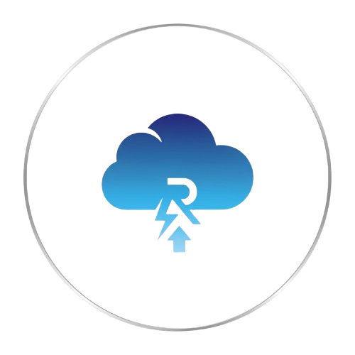

<!-- README.md is generated from README.Rmd. Please edit that file -->

```{r, include = FALSE}
knitr::opts_chunk$set(
  collapse = TRUE,
  comment = "#>",
  fig.path = "man/figures/README-",
  out.width = "100%"
)
```

# meteoLite 
<!-- badges: start -->

[](https://lifecycle.r-lib.org/articles/stages.html#experimental)
<!-- badges: end -->

Paquete de prueba para lectura y análisis de datos meteorológicos.

⚠️ Este paquete está en desarrollo y no está pensado aún para uso productivo. 

Proximamente verás nuevas actualizaciones ...

## Instalación

You can install the development version of meteoLite from [GitHub](https://github.com/) with:

``` r
# install.packages("pak")
pak::pak("GaspiAlfonso/meteoLite")
```

### Descarga de Datos:

Para poder descargar datasets sobre las estaciones meteorológicas  se diseño una función.

**'descarga_data'**: toma como parámetro la estación que se desee descargar, y la ruta donde se guardará la misma.

## Ejemplo

Este es un ejemplo básico que muestra cómo instalar la librería del paquete:

``` r
library(meteoLite)
```

### Desarrollado por:

- [Gaspar Alfonso](https://github.com/GaspiAlfonso)
  Data Scientist Student at Universidad Austral (Rosario) & IA Student. 
  
- [Ingmar Bakker](https://github.com/Ingbakk16)
  Estudiante de Ciencias de Datos en la Universidad Austral

### Constribución al paquete:
1. **Fork y cloná el repositorio**: Haz un *fork* de este repositorio en tu cuenta de GitHub y cloná el repositorio en tu computadora local.

2. **Realizá la contribución y hace un pull request**: Realizá los cambios  que consideres necesarios en tu copia de ese repositorio. 
Posteriormente, abrí un *pull request* a la rama principal del proyecto con una descripción comprensible del propósito de la contribución que realizaste. 

Si tenés dudas o requerías de ayuda sobre constribuciones, contactános:

\- **Alfonso Gaspar**: [galfonso1@mail.austral.edu.ar](mailto:galfonso1@mail.austral.edu.ar)

\- **Ingmar Bakker**: [ingmarbakker@mail.austral.edu.ar](mailto:ingmarbakker@mail.austral.edu.ar)

#### Código de constribución:

